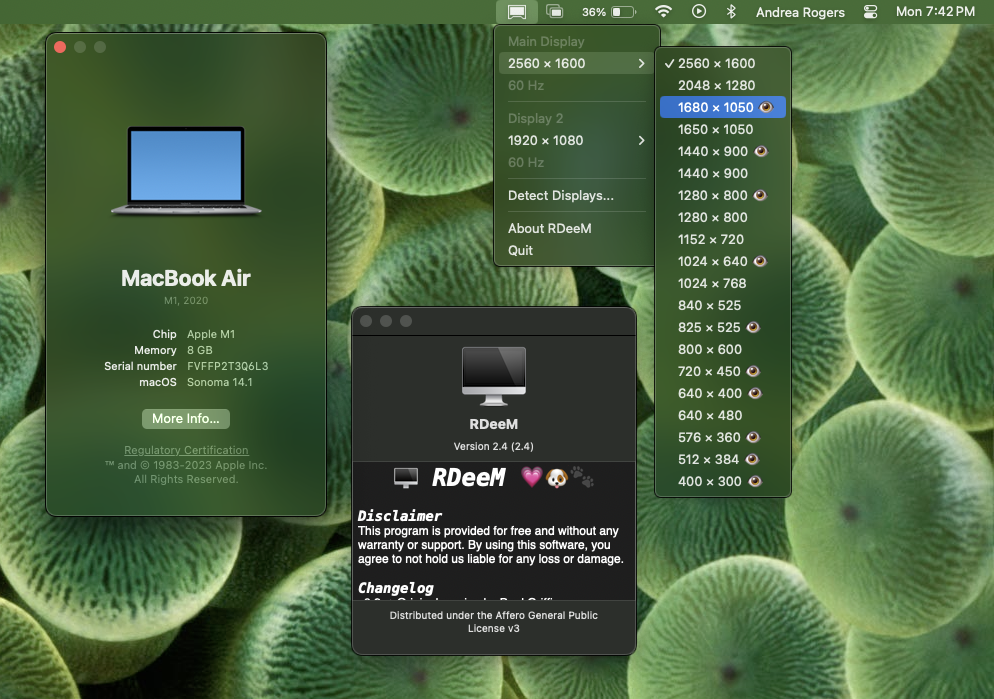

This is a tool that lets you use MacBook Pro Retina's highest and unsupported resolutions.
As an example, a Retina MacBook Pro 13" can be set to 3360×2100 maximum resolution, as
opposed to Apple's max supported 1680×1050. It is accessible from the menu bar.

You should prefer resolutions marked with 👁️ (retina ball), which indicates the
resolution is HiDPI or 2× or more dense in pixels.

For more practical results, add RDeeM.app to your Login Items in
**System Preferences ➡ Users & Groups ➡ Login Items**.
This way RDeeM will run automatically on startup.

This software was studied and released
[here](http://garethjenkins.com/2012/07/01/investigating-a-high-resolution-retina-utility-for-macbook-pro-1x-and-2x-modes/#comment-623)
and [here](http://www.reddit.com/r/apple/comments/vi9yf/set_your_retina_macbook_pros_resolution_to/)
by its original authors. Over the years the community has improved the build
system and Makefile, fixed the icon, added support for easy installable package
(PKG, DMG) and improved the way menu is displayed.  I'm sure the original
authors would enjoy you freely using this software under the AGPLv3 license.
Me too.
